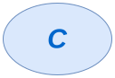

# Learn C language

 

## Index
1. [Introduction](./notes/01_intro.md)
2. [Data types, variables, constants](./notes/02_dataTypeAndVariables.md) 
3. [Comments](./notes/03_comments.md)
4. [Assignment and mathematical operators](./notes/04_assignmentAndMathOperator.md)
5. [Conditionals and comparision operators](./notes/05_conditionalAndCmpOperators.md)
6. [Loops](./notes/06_loops.md)
7. [Exercises - 1](./notes/07_exercise.md)
8. [Arrays](./notes/08_Arrays.md)
9. [Inputs](./notes/09_inputs.md)
10. [Exercises - 2](./notes/10_exercise.md)
11. [Functions](./notes/11_functions.md)
12. [Scopes](./notes/12_scopes.md)
13. [Project 1](./notes/13_project1.md)

